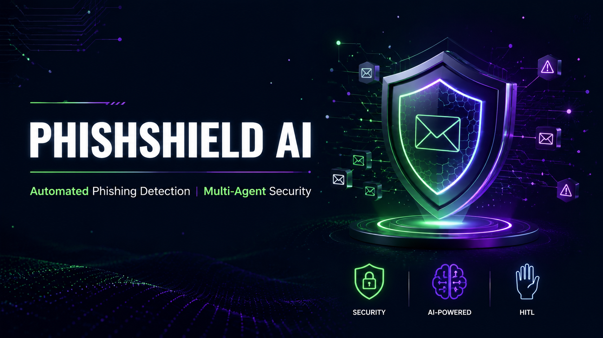
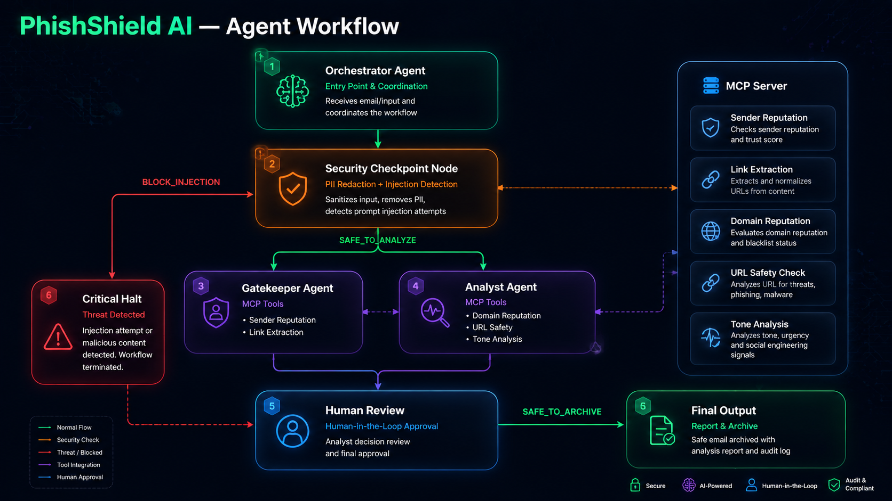

# PhishShield AI



Automated phishing detection system with multi-agent security analysis and human-in-the-loop review.

## Prerequisites

- Python 3.11+
- uv (package manager)
- Gemini API key from https://aistudio.google.com/apikey

## Quick Start

```bash
git clone <repo-url>
cd phishshield-ai
cp .env.example .env  # add your GOOGLE_API_KEY
make install
make playground        # opens UI at http://localhost:18081
```

## Architecture



```
┌─────────────────────────────────────────────────────────────────┐
│                     Orchestrator Agent                          │
│                    (Entry Point & Coordination)                  │
└────────────────────┬────────────────────────────────────────────┘
                     │
                     ▼
┌─────────────────────────────────────────────────────────────────┐
│                  Security Checkpoint Node                       │
│           (PII Redaction + Injection Detection)                  │
└────────────────────┬────────────────────────────────────────────┘
                     │
                     ├─ BLOCK_INJECTION ──► Human Review
                     │
                     └─ SAFE_TO_ANALYZE ──►
                                            │
                                            ▼
┌─────────────────────────────────────────────────────────────────┐
│                    Gatekeeper Agent                              │
│              (MCP Tools: Sender Reputation, Link Extraction)       │
└────────────────────┬────────────────────────────────────────────┘
                     │
                     ├─ BLOCK ──► Human Review
                     │
                     └─ SAFE ──►
                                 │
                                 ▼
┌─────────────────────────────────────────────────────────────────┐
│                     Analyst Agent                                │
│      (MCP Tools: Domain Reputation, URL Safety, Tone Analysis)    │
└────────────────────┬────────────────────────────────────────────┘
                     │
                     ├─ CRITICAL_HALT (score > 7) ──► Human Review
                     │
                     └─ SAFE_TO_ARCHIVE (score ≤ 7) ──► Archive
```

## How to Run

- **Interactive UI**: `make playground` → http://localhost:18081
- **Web server**: `make run` → http://localhost:8000

## Sample Test Cases

### Test Case 1: Safe Email

**Input**:

```json
{
  "email_content": "Hi team, just a reminder about the meeting tomorrow at 2 PM in conference room B. Please bring your laptop. Thanks, Sarah"
}
```

**Expected**: Path: Orchestrator → Security → Gatekeeper → Analyst → Archive
**Check**: Threat score ≤ 7, status SAFE_TO_ARCHIVE

### Test Case 2: Phishing with Urgency

**Input**:

```json
{
  "email_content": "URGENT: Your account will be suspended within 24 hours unless you verify your information immediately at http://verify-account-secure-login.com/update"
}
```

**Expected**: Path: Orchestrator → Security → Gatekeeper → Analyst → Human Review
**Check**: Threat score > 7, status CRITICAL_HALT, domain flagged as suspicious

### Test Case 3: PII with Financial Terms

**Input**:

```json
{
  "email_content": "Please wire transfer $5000 to account 1234-5678-9012-3456. Routing number: 021000021. Contact me at john@example.com"
}
```

**Expected**: Path: Orchestrator → Security → Gatekeeper → Analyst → Human Review
**Check**: PII redacted to [REDACTED], financial content WARNING, human review triggered

## Troubleshooting

1. **Playground won't start**: Ensure port 18081 is not in use. Kill existing process: `Get-Process -Id (Get-NetTCPConnection -LocalPort 18081 -ErrorAction SilentlyContinue).OwningProcess | Stop-Process -Force`
2. **MCP tools not working**: Verify mcp_server.py is in app/ directory and dependencies are installed
3. **404 model error**: Check .env has GEMINI_MODEL=gemini-2.5-flash (not gemini-1.5-\*)
